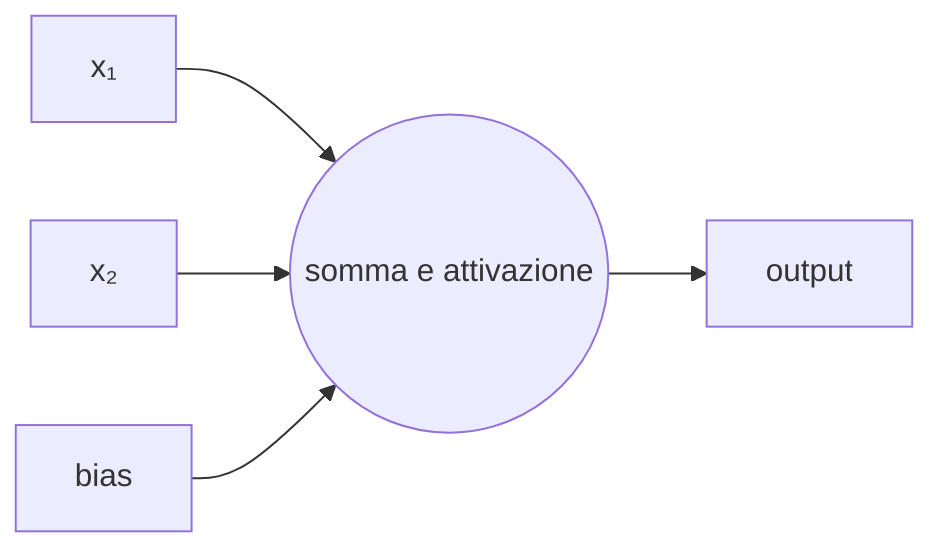
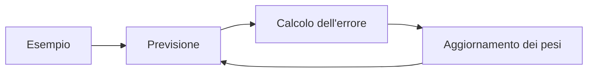

# IA opzionale: reti neurali e IA generativa

Il percorso introduce reti neurali e modelli generativi senza trasformarli in una
“scatola magica”. Ogni attività collega rappresentazione dei dati, addestramento,
valutazione e uso responsabile.

## 1. Programma di 33 ore

| Unità | Ore |
|---|---:|
| percettrone e rete neurale | 6 |
| addestramento ed errore | 5 |
| immagini o testi come numeri | 5 |
| modelli linguistici | 5 |
| recupero di informazioni da fonti | 4 |
| bias, spiegabilità e sicurezza | 4 |
| progetto finale | 4 |
| **Totale** | **33** |

## 2. Dal neurone alla rete

Un'unità artificiale combina input e pesi, aggiunge un termine e applica una funzione.



Una rete contiene molti parametri. Addestrarla significa modificarli per ridurre una funzione di errore.

Al termine del percorso saprai descrivere il funzionamento essenziale di una rete,
preparare dati numerici, valutare un prototipo e riconoscere rischi e limiti.

### 2.1 Un'unità calcolata in Python

```python
def unita(input_, pesi, bias):
    somma = bias
    for valore, peso in zip(input_, pesi):
        somma += valore * peso
    return max(0, somma)


print(unita([0.8, 0.2], [1.5, -0.5], -0.3))
```

`max(0, somma)` è una semplice funzione di attivazione. Una rete reale ripete
questo calcolo in molte unità e modifica i pesi durante l'addestramento.

## 3. Addestramento ed errore

L'addestramento procede per tentativi successivi: il modello produce un risultato,
una funzione misura l'errore e l'algoritmo aggiorna i parametri. Ridurre l'errore
sui dati di addestramento non basta; servono dati nuovi per la valutazione.



In laboratorio si osservano curve di errore già prodotte oppure si usa un ambiente
visuale. Non è necessario implementare da zero l'algoritmo di ottimizzazione.

## 4. Dati numerici

Immagini e testi devono essere trasformati in numeri:

- pixel per immagini;
- token per testi;
- vettori per caratteristiche.

La trasformazione influenza ciò che il modello può apprendere.

### 4.1 Laboratorio sulle immagini

Rappresenta piccole immagini in bianco e nero come matrici di `0` e `1`. Confronta
quali informazioni rimangono dopo riduzione della risoluzione, rotazione o rumore.
L'attività mostra che il dato fornito al modello non coincide con l'oggetto reale.

## 5. Modelli linguistici

Un modello linguistico stima continuazioni probabili. Non conserva automaticamente un archivio di fatti verificati e può produrre informazioni false.

### 5.1 Esperimento controllato

Formula tre richieste sullo stesso argomento: una vaga, una con vincoli e una con
fonti fornite. Registra differenze, affermazioni verificabili e parti incerte. Non
inserire dati personali o documenti riservati.

## 6. Recupero da fonti


Fornire documenti riduce alcuni errori, ma non elimina il bisogno di verificare.

Il prototipo può lavorare su un piccolo insieme di documenti scolastici. Per ogni
risposta deve mostrare il passaggio di origine oppure dichiarare che non possiede
informazioni sufficienti.

## 7. Sicurezza

- non inserire dati riservati;
- trattare l'output come non verificato;
- controllare prompt e documenti provenienti dall'esterno;
- limitare strumenti e permessi;
- registrare le fonti;
- prevedere controllo umano.

## 8. Valutare il prototipo

Prepara almeno dieci casi prima di modificare il sistema. Valuta:

- correttezza rispetto alle fonti;
- presenza di informazioni inventate;
- utilità della risposta;
- comportamento quando la domanda è fuori tema;
- differenze tra formulazioni equivalenti;
- eventuale esposizione di dati non necessari.

Conserva esempi riusciti e falliti: scegliere soltanto le risposte migliori produce
una valutazione ingannevole.

## 9. Progetto finale

Realizza un prototipo circoscritto: classificatore di immagini, analisi di testi o assistente basato su documenti. Documenta dati, metriche, errori e rischi.

Il progetto comprende una scheda del modello, un insieme fisso di casi di prova,
una dimostrazione e una sezione “Quando non usarlo”. La valutazione considera il
metodo e la documentazione, non soltanto l'effetto visivo del risultato.

## 10. Verifica

1. Che cosa viene modificato durante l'addestramento?
2. Perché immagini e testi devono essere convertiti in numeri?
3. Perché un modello linguistico può produrre informazioni false?
4. In che modo le fonti migliorano un assistente e quali problemi restano?
