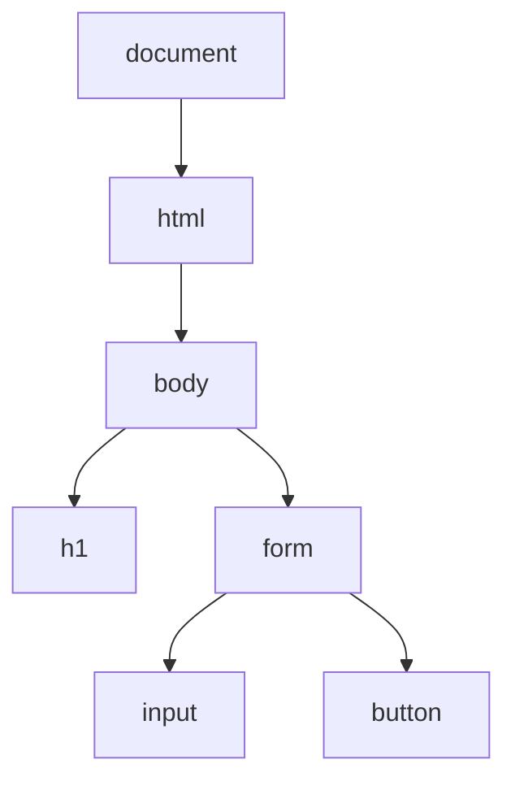

# JavaScript per pagine interattive

## 1. Collegare lo script

```html
<script src="app.js" defer></script>
```

`defer` fa eseguire lo script dopo che il documento è stato analizzato.

## 2. Variabili e tipi

```javascript
const nome = "Ada";
let tentativi = 0;
const temperatura = 21.5;
const valido = true;
```

Si usa `const` quando il nome non deve essere riassegnato; `let` quando il valore cambia.

## 3. Funzioni

```javascript
function celsiusFahrenheit(celsius) {
  return celsius * 9 / 5 + 32;
}

console.log(celsiusFahrenheit(20));
```

## 4. Selezioni e cicli

```javascript
function valuta(voto) {
  if (voto < 0 || voto > 10) {
    return "non valido";
  }
  if (voto >= 6) {
    return "sufficiente";
  }
  return "non sufficiente";
}
```

```javascript
const misure = [18.2, 19.5, 20.1];

for (const misura of misure) {
  console.log(misura);
}
```

Questi costrutti riprendono concetti già studiati in Python. L'attenzione principale è l'interazione con la pagina.

## 5. DOM

Il DOM rappresenta il documento come un albero di oggetti.



```javascript
const titolo = document.querySelector("h1");
titolo.textContent = "Nuovo titolo";
```

## 6. Eventi

HTML:

```html
<button id="calcola" type="button">Calcola</button>
<p id="risultato" aria-live="polite"></p>
```

JavaScript:

```javascript
const pulsante = document.querySelector("#calcola");
const risultato = document.querySelector("#risultato");

pulsante.addEventListener("click", () => {
  risultato.textContent = "Calcolo completato";
});
```

`aria-live` permette alle tecnologie assistive di annunciare un aggiornamento.

## 7. Form

```html
<form id="conversione">
  <label for="celsius">Temperatura in °C</label>
  <input id="celsius" type="number" step="0.1" required>
  <button>Converti</button>
</form>
<p id="output" aria-live="polite"></p>
```

```javascript
const form = document.querySelector("#conversione");
const campo = document.querySelector("#celsius");
const output = document.querySelector("#output");

form.addEventListener("submit", (evento) => {
  evento.preventDefault();
  const valore = Number(campo.value);

  if (!Number.isFinite(valore)) {
    output.textContent = "Inserisci un numero valido";
    return;
  }

  output.textContent = `${celsiusFahrenheit(valore).toFixed(1)} °F`;
});
```

## 8. Creare elementi

```javascript
const lista = document.querySelector("#misure");
const elemento = document.createElement("li");
elemento.textContent = "21,4 °C";
lista.append(elemento);
```

Si preferisce `textContent` quando si inserisce testo fornito dall'utente. Usare `innerHTML` senza controllo può introdurre vulnerabilità.

## 9. Stato semplice

```javascript
const misure = [];

function aggiungiMisura(valore) {
  misure.push(valore);
  aggiornaInterfaccia();
}
```

Lo stato contiene i dati correnti; l'interfaccia li rappresenta.

## 10. Progetto

Realizza una pagina che acquisisca misure, le mostri in una lista, calcoli la media e segnali input non validi. Deve funzionare con mouse e tastiera.
