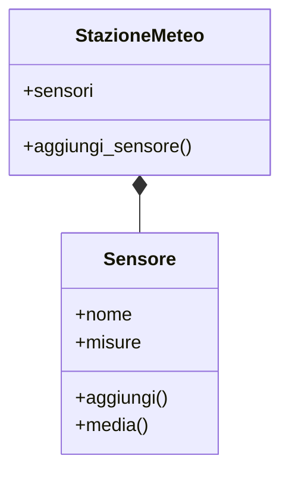

# Programmazione orientata agli oggetti in Python

## 1. Oggetti e classi

Una classe descrive dati e comportamenti di un tipo di oggetto.

```python
class Sensore:
    def __init__(self, nome, unita):
        self.nome = nome
        self.unita = unita
        self.misure = []

    def aggiungi(self, valore):
        self.misure.append(valore)

    def media(self):
        if not self.misure:
            raise ValueError("Non sono presenti misure")
        return sum(self.misure) / len(self.misure)
```

```python
temperatura = Sensore("Temperatura", "°C")
temperatura.aggiungi(20.5)
temperatura.aggiungi(21.0)
print(temperatura.media())
```

La classe è il modello; `temperatura` è un'istanza.

## 2. Attributi e metodi

- gli **attributi** descrivono lo stato;
- i **metodi** descrivono le operazioni.

Un oggetto dovrebbe proteggere le proprie regole:

```python
class Conto:
    def __init__(self, titolare):
        self.titolare = titolare
        self._saldo = 0

    def deposita(self, importo):
        if importo <= 0:
            raise ValueError("L'importo deve essere positivo")
        self._saldo += importo

    def saldo(self):
        return self._saldo
```

Il trattino basso indica che `_saldo` è un dettaglio interno per convenzione.

## 3. Composizione

Un oggetto può contenere altri oggetti.

```python
class StazioneMeteo:
    def __init__(self):
        self.sensori = []

    def aggiungi_sensore(self, sensore):
        self.sensori.append(sensore)
```



La composizione è spesso più semplice dell'ereditarietà.

## 4. Ereditarietà semplice

```python
class Dispositivo:
    def __init__(self, nome):
        self.nome = nome

    def descrizione(self):
        return self.nome


class SensoreTemperatura(Dispositivo):
    def __init__(self, nome, precisione):
        super().__init__(nome)
        self.precisione = precisione

    def descrizione(self):
        return f"{self.nome}, precisione {self.precisione} °C"
```

L'ereditarietà è adatta quando la sottoclasse è realmente un tipo più specifico della classe base.

## 5. Polimorfismo

Oggetti diversi possono rispondere allo stesso metodo:

```python
dispositivi = [
    Dispositivo("generico"),
    SensoreTemperatura("T1", 0.1)
]

for dispositivo in dispositivi:
    print(dispositivo.descrizione())
```

## 6. Testare una classe

```python
sensore = Sensore("Luce", "lux")
sensore.aggiungi(100)
sensore.aggiungi(200)

assert sensore.media() == 150
assert sensore.nome == "Luce"
```

## 7. Progetto

Modella uno dei seguenti sistemi:

- biblioteca;
- laboratorio scientifico;
- registro di misure;
- catalogo di dispositivi.

Usa composizione, validazione e test. L'ereditarietà va usata soltanto se rende il modello più chiaro.
