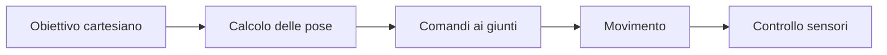
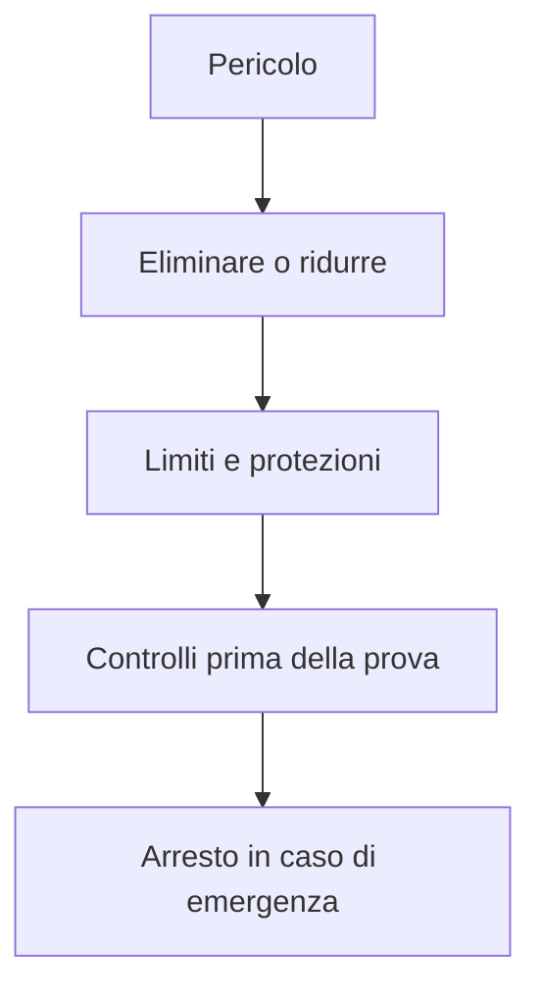
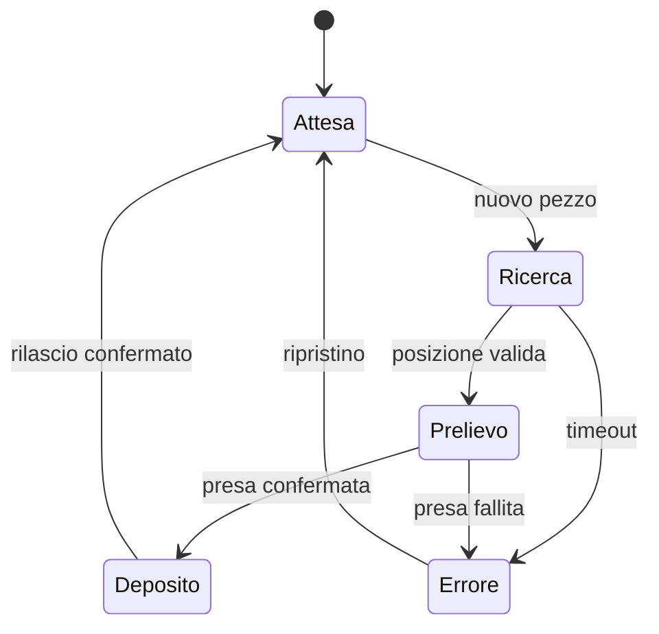

# Robotica opzionale: sistemi robotizzati

Il percorso studia un sistema robotizzato come insieme coordinato di meccanica,
elettronica, software e procedure di sicurezza. Le attività possono essere svolte
con un braccio reale oppure con un simulatore.

## 1. Programma di 33 ore

| Unità | Ore |
|---|---:|
| architettura del sistema | 4 |
| bracci e gradi di libertà | 5 |
| coordinate e traiettorie | 5 |
| controllo e sicurezza | 5 |
| comunicazione tra dispositivi | 4 |
| visione elementare | 4 |
| progetto finale | 6 |
| **Totale** | **33** |

## 2. Gradi di libertà

Un grado di libertà è un movimento indipendente. La posizione del braccio può essere descritta con angoli dei giunti oppure coordinate nello spazio.



Al termine del percorso saprai descrivere una posa, pianificare un movimento
semplice, definire messaggi tra dispositivi e collaudare una cella automatizzata.

### 2.1 Spazio dei giunti e spazio cartesiano

Nello **spazio dei giunti** una posa è descritta dagli angoli dei motori. Nello
**spazio cartesiano** si usano coordinate come `x`, `y` e `z`. Passare dalle
coordinate agli angoli richiede la cinematica inversa e può produrre più soluzioni
oppure nessuna soluzione raggiungibile.

Laboratorio: scegli cinque pose nel simulatore, registra coordinate e angoli dei
giunti e individua configurazioni non raggiungibili o vicine ai limiti.

## 3. Traiettoria

Non basta indicare il punto finale: velocità, accelerazione e percorso devono evitare urti e limiti meccanici.

Una traiettoria troppo rapida può causare vibrazioni, perdita del carico o arresti
di sicurezza. Confronta almeno tre velocità eseguendo lo stesso movimento e misura
tempo, errore finale e numero di fallimenti.

## 4. Sicurezza

- area delimitata;
- velocità ridotta durante le prove;
- arresto accessibile;
- limiti software e meccanici;
- carico compatibile;
- ritorno a posizione sicura.

Prima di ogni prova si esegue una lista di controllo. L'arresto di emergenza non
sostituisce la prevenzione: interviene quando le altre misure non sono bastate.



## 5. Comunicazione

I dispositivi possono scambiare:

- comandi;
- misure;
- stato;
- errori;
- conferme.

Un messaggio deve avere formato chiaro e gestione del timeout.

```python
messaggio = {
    "tipo": "movimento",
    "id": 17,
    "destinazione": [120, 40, 80],
    "velocita": 25
}
```

Il destinatario deve rispondere con lo stesso identificatore e uno stato, per
esempio `accettato`, `completato` oppure `errore`. Se la risposta non arriva entro
il tempo previsto, il sistema passa a uno stato sicuro.

## 6. Visione elementare

Una telecamera produce immagini, non direttamente oggetti. Il laboratorio può usare soglie di colore e contorni, senza richiedere reti neurali.

### 6.1 Laboratorio

Posiziona oggetti di colore noto su uno sfondo uniforme. Varia illuminazione e
distanza, quindi osserva quando la soglia fallisce. Il risultato della visione deve
essere espresso con coordinate e un livello di affidabilità, non soltanto con una
risposta “trovato”.

## 7. Sequenza della cella

Una procedura pick-and-place può essere descritta con stati:



Ogni transizione deve avere una condizione osservabile e un comportamento previsto
in caso di fallimento.

## 8. Progetto finale

Realizza o simula una procedura pick-and-place o una piccola cella automatizzata. Documenta coordinate, sicurezza, ripetibilità e fallimenti.

Consegna requisiti misurabili, schema della cella, diagramma degli stati, registro
di almeno dieci cicli e analisi dei fallimenti. Il collaudo deve includere perdita
del messaggio, pezzo assente e posizione non raggiungibile.

## 9. Verifica

1. Qual è la differenza tra spazio dei giunti e spazio cartesiano?
2. Perché punto finale e traiettoria non sono la stessa cosa?
3. Come deve reagire il sistema a un timeout?
4. Quali condizioni possono rendere instabile una semplice visione a colori?
