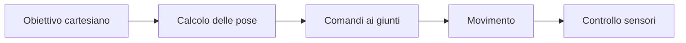

# Robotica opzionale: sistemi robotizzati

## 1. Programma di 33 ore

| Unità | Ore |
|---|---:|
| architettura del sistema | 4 |
| bracci e gradi di libertà | 5 |
| coordinate e traiettorie | 5 |
| controllo e sicurezza | 5 |
| comunicazione tra dispositivi | 4 |
| visione elementare | 4 |
| progetto finale | 6 |
| **Totale** | **33** |

## 2. Gradi di libertà

Un grado di libertà è un movimento indipendente. La posizione del braccio può essere descritta con angoli dei giunti oppure coordinate nello spazio.

## 3. Traiettoria

Non basta indicare il punto finale: velocità, accelerazione e percorso devono evitare urti e limiti meccanici.

## 4. Sicurezza

- area delimitata;
- velocità ridotta durante le prove;
- arresto accessibile;
- limiti software e meccanici;
- carico compatibile;
- ritorno a posizione sicura.

## 5. Comunicazione

I dispositivi possono scambiare:

- comandi;
- misure;
- stato;
- errori;
- conferme.

Un messaggio deve avere formato chiaro e gestione del timeout.

## 6. Visione elementare

Una telecamera produce immagini, non direttamente oggetti. Il laboratorio può usare soglie di colore e contorni, senza richiedere reti neurali.

## 7. Progetto

Realizza o simula una procedura pick-and-place o una piccola cella automatizzata. Documenta coordinate, sicurezza, ripetibilità e fallimenti.
