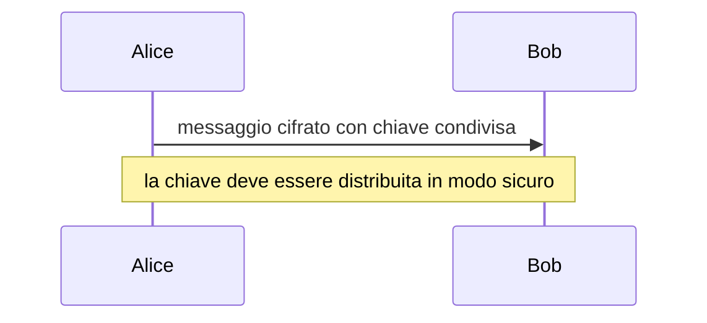
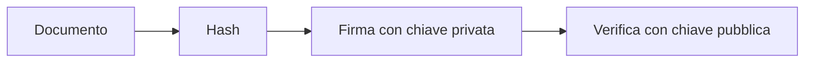

# Crittografia essenziale

## 1. Obiettivi

La crittografia protegge dati e comunicazioni. Nel percorso base non si progettano algoritmi crittografici propri: si comprendono principi e uso corretto delle librerie.

## 2. Cifrario di Cesare

Il cifrario di Cesare sposta le lettere. È utile per studiare modularità e forza bruta, ma non offre sicurezza moderna.

```python
def cesare(testo, chiave):
    risultato = []

    for carattere in testo:
        if carattere.isalpha() and carattere.isascii():
            base = ord("A") if carattere.isupper() else ord("a")
            posizione = ord(carattere) - base
            risultato.append(chr(base + (posizione + chiave) % 26))
        else:
            risultato.append(carattere)

    return "".join(risultato)


print(cesare("Messaggio", 3))
```

Provare tutte le 26 chiavi mostra perché uno spazio delle chiavi piccolo è insicuro.

## 3. Crittografia simmetrica

La stessa chiave segreta cifra e decifra.



AES è un algoritmo simmetrico moderno. Deve essere usato attraverso modalità e librerie affidabili.

## 4. Crittografia asimmetrica

Una coppia contiene:

- chiave pubblica, distribuibile;
- chiave privata, da proteggere.

La crittografia asimmetrica può essere usata per accordo di chiavi e firme. È più costosa di quella simmetrica; i sistemi pratici combinano i due approcci.

## 5. Hash

Una funzione hash crittografica produce un'impronta di lunghezza fissa.

```python
import hashlib

testo = "documento"
impronta = hashlib.sha256(testo.encode("utf-8")).hexdigest()
print(impronta)
```

Un hash:

- non cifra il dato;
- non usa una chiave in questo esempio;
- cambia molto se cambia l'input;
- può verificare l'integrità.

Le password non si conservano con un semplice SHA-256: si usano funzioni specifiche lente e un salt, gestite da librerie affidabili.

## 6. Firma digitale

La firma permette di verificare integrità e provenienza in base a chiavi e certificati.



La firma non rende segreto il documento.

## 7. Certificati e HTTPS

Un certificato collega una chiave pubblica a un'identità. Il browser verifica una catena di fiducia.

HTTPS protegge la comunicazione tra browser e server. Non garantisce che ogni contenuto del sito sia vero o onesto.

## 8. Gestione delle chiavi

- non inserire chiavi nel codice pubblico;
- limitare accessi;
- prevedere rotazione e revoca;
- usare generatori sicuri;
- non inventare protocolli;
- aggiornare librerie.

## 9. Laboratorio

1. Implementa e attacca il cifrario di Cesare.
2. Calcola l'hash di due file quasi uguali.
3. Verifica l'hash di un file scaricato.
4. Ispeziona il certificato di un sito.
5. Spiega differenze tra cifratura, hash e firma.
