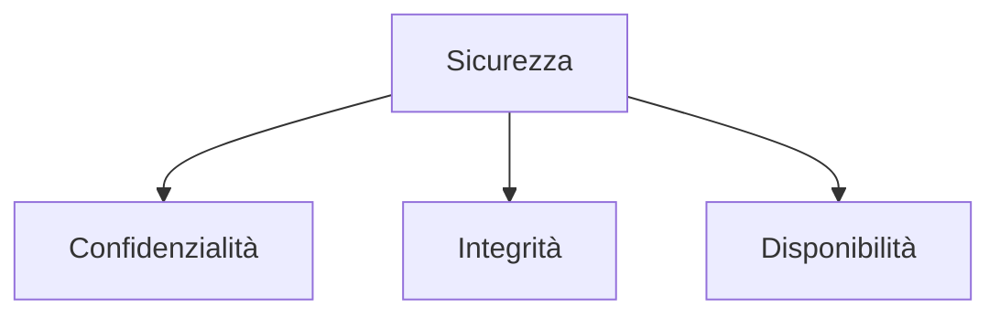
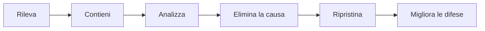

# Cybersicurezza

## 1. Che cosa proteggere

La sicurezza mira a proteggere:

- **confidenzialità**: dati accessibili soltanto a chi è autorizzato;
- **integrità**: dati non modificati senza autorizzazione;
- **disponibilità**: servizi utilizzabili quando servono.

## 2. Minaccia, vulnerabilità e rischio

- **minaccia**: evento che può causare danno;
- **vulnerabilità**: debolezza sfruttabile;
- **rischio**: combinazione tra probabilità e conseguenze.

Prima di scegliere una difesa si chiariscono risorse, minacce e impatto.

## 3. Malware

- virus: si inserisce in altri file;
- worm: si diffonde attraverso reti;
- trojan: si presenta come programma legittimo;
- ransomware: impedisce l'accesso ai dati e richiede un riscatto;
- spyware: raccoglie informazioni senza consenso.

Difese:

- aggiornamenti;
- account senza privilegi inutili;
- fonti affidabili;
- backup isolati e provati;
- protezioni del sistema;
- formazione degli utenti.

## 4. Ingegneria sociale

Il phishing sfrutta urgenza, paura, curiosità o autorità.

Procedura:

1. fermarsi;
2. controllare mittente e destinazione;
3. non usare il link ricevuto per accedere;
4. verificare con un altro canale;
5. segnalare;
6. cambiare credenziali se sono state inserite.

## 5. Autenticazione

Una password deve essere lunga e unica. Un gestore di password aiuta a generarla e conservarla.

Fattori:

- qualcosa che conosci;
- qualcosa che possiedi;
- qualcosa che sei.

L'autenticazione a più fattori riduce il rischio, ma non rende impossibile ogni attacco.

## 6. Minimo privilegio

Ogni utente o programma riceve soltanto i permessi necessari. Questo limita il danno in caso di errore o compromissione.

## 7. Backup

Una strategia efficace conserva copie:

- su supporti differenti;
- in posizioni differenti;
- non tutte modificabili dallo stesso account.

Il ripristino deve essere provato.

## 8. Analisi di un incidente

Non si cancellano subito tutte le tracce: possono servire per capire la causa.

## 9. Laboratorio

Analizza uno scenario:

- risorsa da proteggere;
- minacce;
- vulnerabilità;
- impatto;
- difese preventive;
- procedura di risposta;
- metodo di ripristino.
