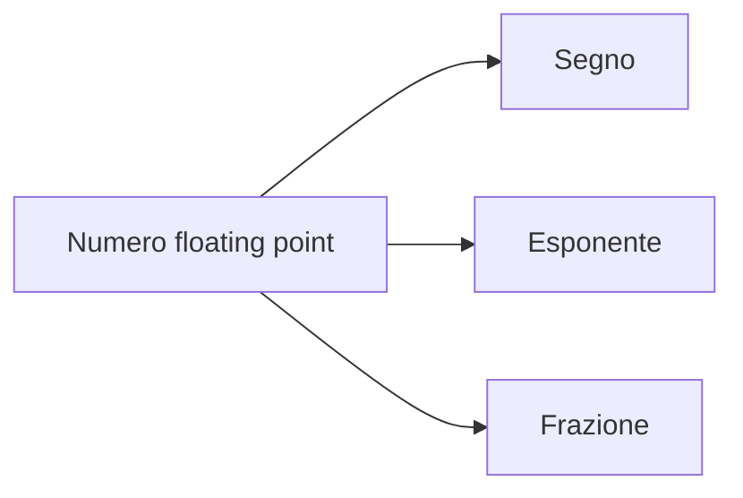

# Errori numerici e numeri macchina

## 1. Valore esatto e approssimazione

Un numero memorizzato dal computer può essere un'approssimazione.

```python
print(0.1 + 0.2)
```

Il risultato non è esattamente `0.3` perché molte frazioni decimali non hanno una rappresentazione binaria finita.

## 2. Errore assoluto e relativo

```text
errore assoluto = |valore approssimato - valore esatto|
```

```text
errore relativo = errore assoluto / |valore esatto|
```

L'errore relativo permette di confrontare misure di grandezza diversa.

```python
def errori(esatto, approssimato):
    assoluto = abs(approssimato - esatto)
    if esatto == 0:
        relativo = None
    else:
        relativo = assoluto / abs(esatto)
    return assoluto, relativo
```

## 3. Virgola mobile

Lo standard IEEE 754 rappresenta un numero usando:

- segno;
- esponente;
- frazione significativa.



La precisione è limitata. Numeri molto grandi e numeri molto piccoli non possono essere tutti rappresentati.

## 4. Valori speciali

```python
import math

infinito = float("inf")
non_numero = float("nan")

print(math.isinf(infinito))
print(math.isnan(non_numero))
```

`NaN` indica un risultato numerico non definito. Non va confrontato con `==`; si usa `math.isnan()`.

## 5. Arrotondamento e troncamento

- **arrotondamento**: sceglie il valore rappresentabile più vicino secondo una regola;
- **troncamento**: elimina una parte senza compensarla.

Ripetere molte operazioni può accumulare errore.

## 6. Cancellazione numerica

Sottrarre numeri quasi uguali può eliminare cifre significative.

Esempio matematico:

```text
sqrt(x + 1) - sqrt(x)
```

Per `x` grande è spesso più stabile la forma equivalente:

```text
1 / (sqrt(x + 1) + sqrt(x))
```

## 7. Propagazione degli errori

Se gli input sono approssimati, anche il risultato lo sarà. Un problema **mal condizionato** amplifica piccole variazioni dei dati.

Un algoritmo è **numericamente stabile** quando non amplifica inutilmente gli errori introdotti dai calcoli.

## 8. Laboratorio

1. Confronta somme ripetute di `0.1`.
2. Usa `math.isclose()` invece del confronto esatto.
3. Calcola errore assoluto e relativo di alcune misure.
4. Confronta due formule matematicamente equivalenti.
5. Spiega perché stampare poche cifre non elimina l'errore interno.
