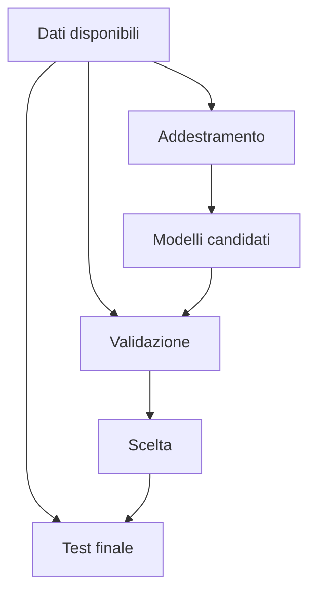

# IA opzionale: progetto e valutazione critica

## 1. Programma di 33 ore

| Unità | Ore |
|---|---:|
| definizione del problema | 3 |
| costruzione del dataset | 5 |
| scelta e addestramento del modello | 6 |
| valutazione e confronto | 5 |
| interpretazione degli errori | 4 |
| etica, impatto e documentazione | 4 |
| progetto finale | 6 |
| **Totale** | **33** |

## 2. Definire il problema

Una buona domanda specifica:

- input;
- output;
- utenti;
- criterio di successo;
- errori tollerabili;
- vincoli legali ed etici.

Non ogni problema richiede IA. Si confronta sempre con una regola o un metodo più semplice.

## 3. Dataset

La scheda del dataset indica:

- provenienza;
- licenza;
- metodo di raccolta;
- variabili;
- valori mancanti;
- popolazione rappresentata;
- usi vietati o rischiosi.

## 4. Modello di base

Prima di un modello complesso si costruisce una **baseline**. Può essere la media, la classe più frequente o una regola semplice.

Il nuovo modello è utile soltanto se migliora la baseline in modo significativo per il problema reale.

## 5. Valutazione

Il test finale non viene usato continuamente per prendere decisioni, altrimenti perde la sua funzione.

Metriche possibili:

- accuratezza;
- precisione e richiamo;
- errore assoluto medio;
- tempo di esecuzione;
- consumo di risorse;
- prestazioni su gruppi differenti.

## 6. Interpretare gli errori

Si esaminano esempi sbagliati e si chiede:

- il dato era corretto?
- la categoria era ambigua?
- il modello ha visto casi simili?
- l'errore colpisce alcuni gruppi più di altri?
- la metrica nasconde un problema?

## 7. Documentazione

Il rapporto finale contiene:

1. obiettivo;
2. dati;
3. baseline;
4. modelli provati;
5. metriche;
6. errori;
7. limiti;
8. impatto;
9. istruzioni per riprodurre il lavoro.

## 8. Progetto finale

Il progetto deve rispondere a una domanda scientifica, ambientale o scolastica. Non deve trattare dati sensibili senza autorizzazione e misure adeguate.
