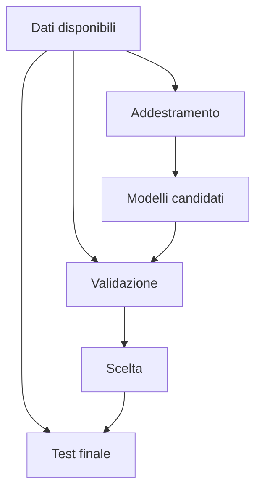

# IA opzionale: progetto e valutazione critica

Il quinto anno è organizzato come un piccolo progetto di ricerca applicata. Gli
studenti scelgono una domanda circoscritta, confrontano una soluzione semplice con
un modello e comunicano risultati e limiti in modo trasparente.

## 1. Programma di 33 ore

| Unità | Ore |
|---|---:|
| definizione del problema | 3 |
| costruzione del dataset | 5 |
| scelta e addestramento del modello | 6 |
| valutazione e confronto | 5 |
| interpretazione degli errori | 4 |
| etica, impatto e documentazione | 4 |
| progetto finale | 6 |
| **Totale** | **33** |

## 2. Definire il problema

Una buona domanda specifica:

- input;
- output;
- utenti;
- criterio di successo;
- errori tollerabili;
- vincoli legali ed etici.

Non ogni problema richiede IA. Si confronta sempre con una regola o un metodo più semplice.

Al termine del percorso saprai formulare requisiti, documentare un dataset,
scegliere metriche coerenti, confrontare modelli e discutere impatto e affidabilità.

### 2.1 Scheda del problema

Prima di raccogliere dati completa una pagina con:

| Domanda | Esempio |
|---|---|
| chi userà il risultato? | responsabile del laboratorio |
| quale decisione supporta? | controllare una misura anomala |
| qual è l'output? | normale oppure da verificare |
| quale errore è più grave? | non segnalare un'anomalia reale |
| esiste una soluzione senza IA? | soglia stabilita dall'esperto |

## 3. Dataset

La scheda del dataset indica:

- provenienza;
- licenza;
- metodo di raccolta;
- variabili;
- valori mancanti;
- popolazione rappresentata;
- usi vietati o rischiosi.

Il dataset va esplorato prima dell'addestramento. Si controllano distribuzioni,
duplicati, valori mancanti e possibili collegamenti indiretti con informazioni
personali. La rimozione di una colonna sensibile non garantisce da sola l'anonimato.

### 3.1 Laboratorio di qualità

Ricevi una copia volutamente imperfetta di un dataset. Produci un rapporto con
errori trovati, decisioni di pulizia e conseguenze possibili. Conserva sia i dati
originali sia la versione elaborata.

## 4. Modello di base

Prima di un modello complesso si costruisce una **baseline**. Può essere la media, la classe più frequente o una regola semplice.

Il nuovo modello è utile soltanto se migliora la baseline in modo significativo per il problema reale.

Il confronto deve usare gli stessi esempi e la stessa metrica. Un modello più
complesso che migliora di pochissimo può non giustificare maggiori costi, difficoltà
di spiegazione o consumo di risorse.

## 5. Valutazione

Il test finale non viene usato continuamente per prendere decisioni, altrimenti perde la sua funzione.

Metriche possibili:

- accuratezza;
- precisione e richiamo;
- errore assoluto medio;
- tempo di esecuzione;
- consumo di risorse;
- prestazioni su gruppi differenti.

La metrica dipende dal rischio. In uno screening può essere importante trovare
quasi tutti i casi rilevanti; in un sistema che blocca automaticamente un contenuto
può essere grave produrre troppi falsi allarmi.

## 6. Interpretare gli errori

Si esaminano esempi sbagliati e si chiede:

- il dato era corretto?
- la categoria era ambigua?
- il modello ha visto casi simili?
- l'errore colpisce alcuni gruppi più di altri?
- la metrica nasconde un problema?

Costruisci un **catalogo degli errori**: raggruppa i fallimenti per causa probabile,
frequenza e conseguenza. Scegli poi un intervento, come raccogliere dati mancanti,
correggere etichette o modificare la rappresentazione. Non basta aumentare
automaticamente la complessità del modello.

## 7. Robustezza e cambiamento nel tempo

Un sistema può funzionare bene durante il progetto e peggiorare quando cambiano
utenti, strumenti o ambiente. Questo fenomeno viene spesso chiamato **deriva dei
dati**.

Prepara tre prove fuori dalle condizioni abituali: valori vicini ai limiti, dati
rumorosi e un gruppo poco rappresentato. Descrivi quando il sistema dovrebbe
rifiutarsi di decidere e richiedere un controllo umano.

## 8. Documentazione

Il rapporto finale contiene:

1. obiettivo;
2. dati;
3. baseline;
4. modelli provati;
5. metriche;
6. errori;
7. limiti;
8. impatto;
9. istruzioni per riprodurre il lavoro.

Il rapporto include anche una **scheda del modello** con uso previsto, usi da
evitare, versione, dati di valutazione e responsabilità di chi lo impiega.

## 9. Progetto finale

Il progetto deve rispondere a una domanda scientifica, ambientale o scolastica. Non deve trattare dati sensibili senza autorizzazione e misure adeguate.

### 9.1 Tappe

1. proposta e valutazione di fattibilità;
2. scheda del dataset;
3. baseline riproducibile;
4. primo modello e revisione tra pari;
5. valutazione su dati mantenuti separati;
6. catalogo degli errori;
7. relazione, dimostrazione e discussione critica.

La valutazione considera formulazione del problema, qualità del metodo,
riproducibilità, lettura degli errori e chiarezza della comunicazione.

## 10. Verifica conclusiva

1. Perché una baseline è necessaria?
2. In che modo la scelta della metrica dipende dal rischio?
3. Che cosa indica la deriva dei dati?
4. Quando un modello dovrebbe rinviare la decisione a una persona?
