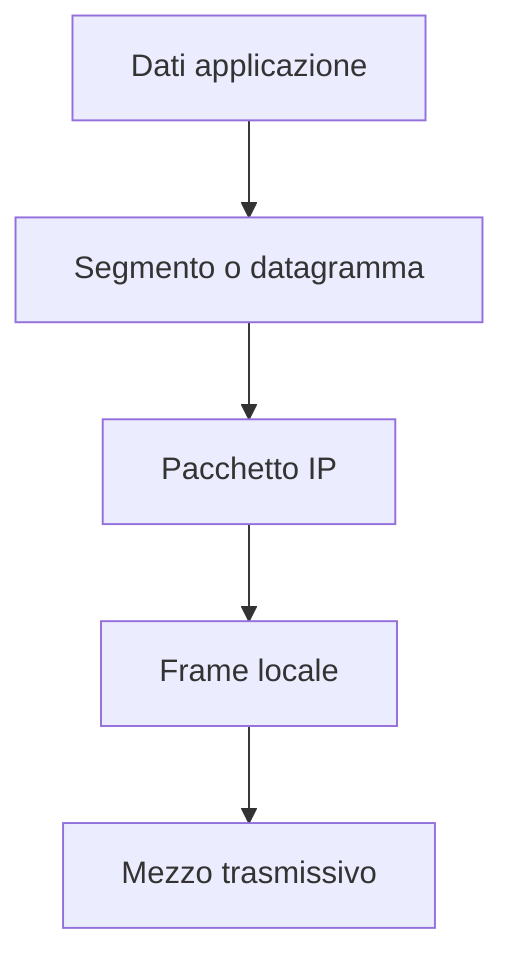
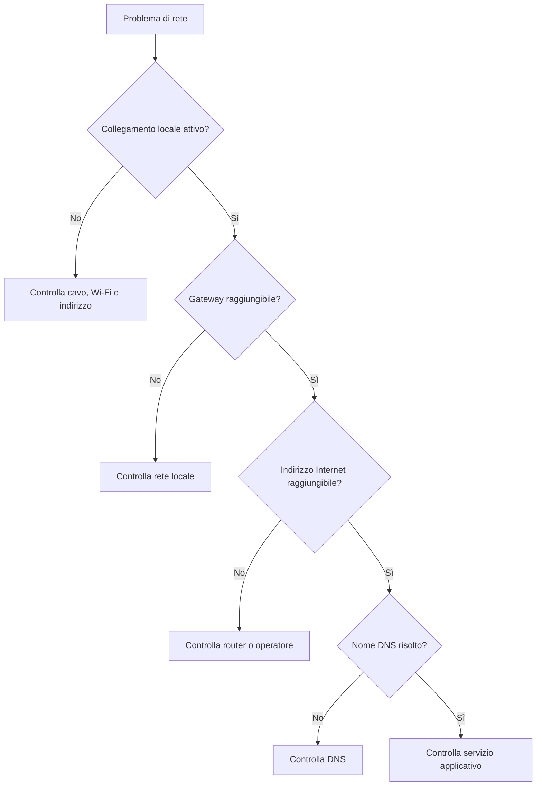

# Reti di calcolatori

## 1. Obiettivi

Al termine del modulo lo studente sa:

- riconoscere dispositivi e topologie;
- spiegare i livelli TCP/IP;
- leggere una configurazione IP;
- usare strumenti di diagnosi;
- progettare una piccola rete.

## 2. Dispositivi

| Dispositivo | Funzione |
|---|---|
| switch | collega nodi nella LAN |
| router | collega reti diverse |
| access point | offre accesso Wi-Fi |
| modem/ONT | adatta il collegamento alla rete dell'operatore |
| firewall | applica regole al traffico |

## 3. Topologie

- **stella**: i nodi si collegano a un dispositivo centrale;
- **maglia**: esistono più percorsi;
- **bus** e **anello**: importanti soprattutto per comprendere soluzioni storiche o specifiche.

Nelle LAN Ethernet moderne la stella è molto comune.

## 4. Livelli TCP/IP

| Livello | Compito | Esempi |
|---|---|---|
| applicazione | servizi usati dai programmi | HTTP, DNS, SMTP |
| trasporto | comunicazione tra processi | TCP, UDP |
| Internet | indirizzamento e inoltro | IP |
| accesso alla rete | trasmissione locale | Ethernet, Wi-Fi |



Ogni livello aggiunge informazioni di controllo. Il destinatario esegue il percorso inverso.

## 5. TCP e UDP

TCP offre un flusso ordinato e controlla perdite. UDP invia datagrammi senza stabilire lo stesso tipo di connessione.

UDP non è “migliore per lo streaming” in ogni situazione: la scelta dipende dal protocollo applicativo, dalla latenza tollerata e dal modo in cui vengono gestite le perdite.

## 6. IPv4

Un indirizzo IPv4 contiene 32 bit.

Esempio:

```text
192.168.10.25/24
```

Con prefisso `/24`:

- rete: `192.168.10.0`;
- host utilizzabili: dipendono dalle regole della rete;
- broadcast tradizionale: `192.168.10.255`.

Gli indirizzi privati non vengono instradati direttamente su Internet. Il router domestico usa normalmente NAT per tradurre le comunicazioni.

## 7. Gateway e DNS

- **gateway predefinito**: router usato per raggiungere altre reti;
- **DNS**: traduce nomi in indirizzi;
- **DHCP**: assegna parametri automaticamente.

Un dispositivo può essere collegato al Wi-Fi ma non navigare se DNS o gateway sono errati.

## 8. Diagnosi

Procedura:



Strumenti:

```text
ipconfig
ping
tracert
nslookup
```

Su Linux e macOS alcuni nomi cambiano, per esempio `ip`, `traceroute` e `dig`.

## 9. Wireshark: osservazione guidata

In laboratorio si può osservare una richiesta DNS o HTTP non contenente dati personali. Una cattura può mostrare:

- indirizzi;
- protocolli;
- porte;
- tempi;
- dimensioni.

Non si cattura traffico di altre persone senza autorizzazione.

## 10. Progetto

Progetta la rete di un laboratorio:

1. disegna la topologia;
2. scegli indirizzi;
3. indica switch, router e access point;
4. separa eventuali dispositivi ospiti;
5. definisci backup e sicurezza;
6. prepara un piano di diagnosi.
