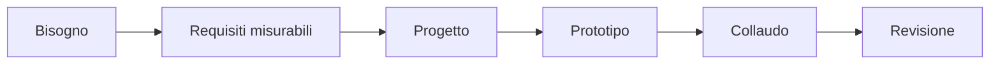

# Robotica opzionale: progetto interdisciplinare

## 1. Programma di 33 ore

| Unità | Ore |
|---|---:|
| analisi del bisogno | 3 |
| requisiti e rischi | 4 |
| progettazione meccanica ed elettronica | 5 |
| programmazione e controllo | 6 |
| integrazione | 5 |
| collaudo | 4 |
| documentazione finale | 6 |
| **Totale** | **33** |

## 2. Dal bisogno ai requisiti

Un requisito utile può essere verificato. “Il robot è preciso” è vago; “raggiunge il punto entro 5 mm in nove prove su dieci” è misurabile.

## 3. Valutare i rischi

Per ogni pericolo si stimano probabilità, conseguenza e misure di riduzione. Sicurezza elettrica, movimento, batterie e dati devono essere considerati prima delle prove.

## 4. Integrazione

Ogni componente viene provato separatamente prima di collegarlo agli altri. Si definiscono interfacce, unità di misura e comportamento in caso di errore.

## 5. Collaudo

| Requisito | Procedura | Criterio |
|---|---|---|
| arresto | attivare stop durante il moto | arresto controllato |
| ripetibilità | eseguire dieci cicli | almeno nove successi |
| autonomia | eseguire ciclo continuo | durata minima concordata |

## 6. Progetto

Possibili temi:

- monitoraggio ambientale;
- supporto a una serra;
- veicolo di ispezione;
- manipolazione di oggetti;
- assistenza in laboratorio.

La documentazione comprende schema, codice, versioni, rischi, test, dati, limiti e miglioramenti.
