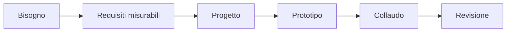
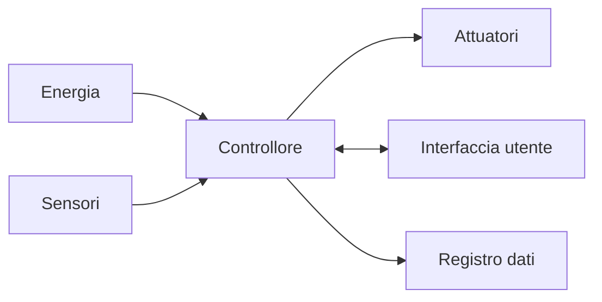

# Robotica opzionale: progetto interdisciplinare

Il percorso finale simula un piccolo progetto di ingegneria. Il risultato non è
soltanto il robot funzionante: comprende requisiti, gestione dei rischi, prove,
dati, versioni del software e comunicazione delle scelte.

## 1. Programma di 33 ore

| Unità | Ore |
|---|---:|
| analisi del bisogno | 3 |
| requisiti e rischi | 4 |
| progettazione meccanica ed elettronica | 5 |
| programmazione e controllo | 6 |
| integrazione | 5 |
| collaudo | 4 |
| documentazione finale | 6 |
| **Totale** | **33** |

## 2. Dal bisogno ai requisiti

Un requisito utile può essere verificato. “Il robot è preciso” è vago; “raggiunge il punto entro 5 mm in nove prove su dieci” è misurabile.

Al termine del percorso saprai trasformare un bisogno in requisiti, dividere il
sistema in componenti, pianificare l'integrazione e condurre un collaudo documentato.

### 2.1 Tipi di requisito

- **funzionale**: descrive che cosa deve fare il sistema;
- **prestazionale**: assegna un valore a tempo, precisione o autonomia;
- **di sicurezza**: impone condizioni per prevenire danni;
- **di interfaccia**: stabilisce come comunicano i componenti;
- **di manutenzione**: rende possibile diagnosi e sostituzione delle parti.

Ogni requisito riceve un identificatore, per esempio `R-SIC-03`, che verrà usato
anche nel piano di collaudo.

## 3. Valutare i rischi

Per ogni pericolo si stimano probabilità, conseguenza e misure di riduzione. Sicurezza elettrica, movimento, batterie e dati devono essere considerati prima delle prove.

| Pericolo | Probabilità | Conseguenza | Misura |
|---|---|---|---|
| urto durante il moto | media | media | velocità limitata e area delimitata |
| corto circuito | bassa | alta | controllo dei collegamenti senza alimentazione |
| batteria danneggiata | bassa | alta | ispezione e contenitore adatto |

La tabella viene aggiornata quando cambia il progetto o compare un nuovo problema.

## 4. Architettura del sistema

Prima della costruzione si rappresentano i sottosistemi e le loro interfacce:

Per ogni collegamento si indicano tensione, tipo di segnale, unità di misura,
frequenza di aggiornamento e comportamento in caso di dato mancante.

## 5. Integrazione

Ogni componente viene provato separatamente prima di collegarlo agli altri. Si definiscono interfacce, unità di misura e comportamento in caso di errore.

L'integrazione procede in passi piccoli:

1. alimentazione e arresto;
2. lettura dei sensori;
3. comando manuale degli attuatori;
4. singoli comportamenti automatici;
5. ciclo completo;
6. gestione degli errori.

Dopo ogni passo si conserva una versione funzionante. Se il sistema smette di
funzionare, si può così individuare l'ultima modifica introdotta.

## 6. Collaudo

| Requisito | Procedura | Criterio |
|---|---|---|
| arresto | attivare stop durante il moto | arresto controllato |
| ripetibilità | eseguire dieci cicli | almeno nove successi |
| autonomia | eseguire ciclo continuo | durata minima concordata |

Un risultato isolato non misura la ripetibilità. Ogni prova prestazionale viene
ripetuta un numero concordato di volte e produce dati, non soltanto “superata” o
“fallita”.

### 6.1 Analizzare un fallimento

Quando una prova fallisce:

1. si mette il sistema in sicurezza;
2. si conserva il registro degli eventi;
3. si riproduce il problema con il caso più semplice;
4. si formula un'ipotesi;
5. si modifica una sola causa;
6. si ripete l'intero gruppo di prove interessato.

## 7. Organizzazione del gruppo

I ruoli possono comprendere coordinamento, meccanica, elettronica, software,
collaudo e documentazione. I ruoli cambiano durante il percorso, in modo che ogni
studente partecipi sia alla costruzione sia alla verifica.

Il diario di progetto registra decisioni, alternative scartate, problemi aperti e
responsabile del passo successivo.

## 8. Progetto finale

Possibili temi:

- monitoraggio ambientale;
- supporto a una serra;
- veicolo di ispezione;
- manipolazione di oggetti;
- assistenza in laboratorio.

La documentazione comprende schema, codice, versioni, rischi, test, dati, limiti e miglioramenti.

### 8.1 Revisioni previste

- revisione dei requisiti e dei rischi;
- revisione dell'architettura;
- dimostrazione dei sottosistemi;
- prova di integrazione;
- collaudo finale;
- presentazione pubblica con analisi dei limiti.

La valutazione separa processo e risultato: un prototipo incompleto ma ben
progettato, documentato e analizzato può mostrare competenze maggiori di una
dimostrazione riuscita una sola volta.

## 9. Verifica conclusiva

1. Trasforma un requisito vago in uno misurabile.
2. Perché i componenti si provano separatamente?
3. Qual è la differenza tra funzionamento e ripetibilità?
4. Quali informazioni deve contenere il diario di progetto?
