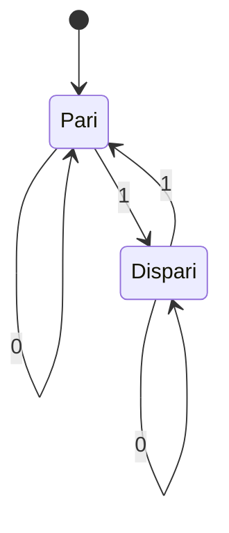
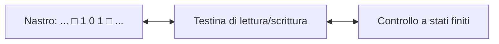

# Teoria della computazione

## Sistemi, modelli e automi

Un **sistema** è un insieme di elementi che interagiscono. Un modello ne conserva gli aspetti utili allo studio. Un **automa** è un modello matematico di un esecutore: riceve simboli, cambia stato secondo regole definite e può produrre un risultato.

## Automi a stati finiti

Un automa finito deterministico (DFA) è descritto da un insieme finito di stati, un alfabeto, una funzione di transizione, uno stato iniziale e uno o più stati di accettazione.

Esempio: riconoscere stringhe binarie con un numero pari di `1`.



Lo stato `Pari` è iniziale e di accettazione. Ogni `1` cambia la parità; ogni `0` la lascia invariata.

## Simulazione in Python

```python
def numero_di_uno_pari(stringa):
    stato = "pari"

    for simbolo in stringa:
        if simbolo not in {"0", "1"}:
            raise ValueError("La stringa deve contenere solo 0 e 1")
        if simbolo == "1":
            stato = "dispari" if stato == "pari" else "pari"

    return stato == "pari"


assert numero_di_uno_pari("1010")
assert numero_di_uno_pari("000")
assert not numero_di_uno_pari("111")
print(numero_di_uno_pari("11001"))
```

Il tempo cresce linearmente con la lunghezza della stringa, `O(n)`; la memoria aggiuntiva rimane costante, `O(1)`.

## Dall'automa alla macchina di Turing

Un automa finito possiede soltanto lo stato corrente come memoria. Una **macchina di Turing** ideale dispone invece di un nastro potenzialmente illimitato, una testina che legge e scrive simboli e una tabella di transizione.



A ogni passo legge un simbolo, ne scrive uno, sposta la testina e cambia stato oppure si arresta. La **tesi di Church-Turing** afferma che ogni procedimento effettivamente calcolabile può essere eseguito da una macchina di Turing. È una tesi, non un teorema, perché collega una nozione intuitiva a un modello formale.

## Decidibilità e problema dell'arresto

Un problema è **decidibile** se esiste un algoritmo che termina sempre e risponde correttamente per ogni input. Non esiste invece un algoritmo generale capace di stabilire, per qualunque programma e input, se quel programma terminerà: è il **problema dell'arresto**.

Ciò non impedisce di studiare programmi specifici; esclude un metodo universale corretto per tutti i programmi possibili.

## Complessità

La calcolabilità chiede *se* un problema possa essere risolto; la complessità studia *quante risorse* richieda la soluzione.

| Complessità | Esempio intuitivo |
|---|---|
| `O(1)` | accesso tramite indice |
| `O(log n)` | ricerca binaria |
| `O(n)` | scansione di una lista |
| `O(n²)` | confronto di tutte le coppie |
| `O(2^n)` | esplorazione di molti sottoinsiemi |

## Domande ed esercizi

1. Disegna un automa che accetti stringhe binarie che terminano con `01`.
2. Simula l'automa della parità sugli input `101`, `1111` e stringa vuota.
3. Spiega la differenza tra indecidibilità e inefficienza.
4. Modifica il programma Python per restituire gli stati visitati.

